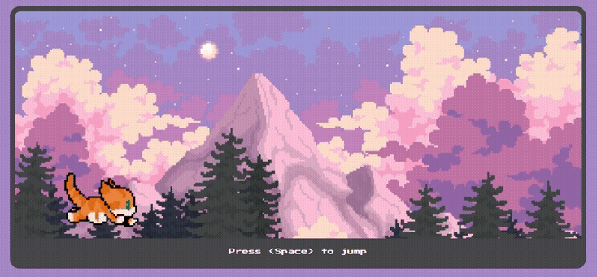

# Cat Jump :cat2:

  
        
  

## :pencil: Description

**Cat Jump** is a simple and fun web game, developed entirely with pure HTML, CSS, and JavaScript, without the use of frameworks.  
    
The goal of the game is to help a cat jump over animated blocks that run from right to left on the screen. The player must press the *Space* key to make the cat jump, and the game ends when the cat hits one of the blocks.  

## :wrench: Technologies

- **HTML**: Structure the game's content.
- **CSS**: Style the game, including animations and positioning of elements on the screen.
- **JavaScript**: Add interactivity to the game, such as the cat's jump logic and collision detection.
- **Deploy:** The project was deployed via [Vercel](https://vercel.com/), a web hosting platform that allows simple and efficient deployment of both static and dynamic projects.  

## :video_game: How to Play

1. Click on the game link at the top of this document.
2. Press the *Space* key to make the cat jump.
3. Avoid letting the cat hit the blocks.
4. Earn points by jumping over the blocks.
5. The game ends when the cat hits a block.
6. Press the **Play Again** button to restart the game and reset the score.

## Enjoy the Game! :smile_cat: :sparkling_heart:   